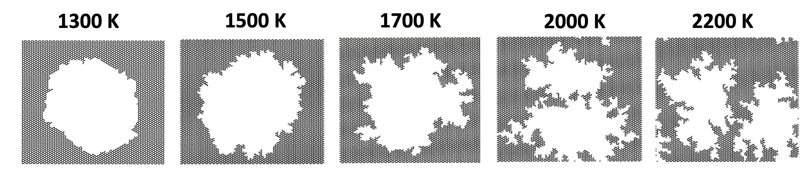

# Hyperthermal Oxidation of Graphite using Atomistic kinetic Monte Carlo (A-kMC) Simulations
An Atomistic kinetic Monte Carlo model is used to simulate defect generation in multi-layer graphene due to atomic and molecular oxygen. The purpose of these simulations is to study the erosion of Thermal Protection System (TPS) materials at high temperatures during space reentry to earth. 

Simulations based on this KMC model reveal details of the pitting process driven by oxygen adsorption and surface diffusion in multi-layer graphene for specific temperatures and partial pressures of atomic and molecular oxygen. The model implemented here consists of 43 reactions between carbon and oxygen, categorized as adsorption, diffusion, surface and gasification reactions. The following figures shows the oxidation of graphite consisting of five graphene layers at 1700 K and 10kPa.

As the temperature increases from 1300 K to 2200 K, the shape of the defects transitions from hexagonal to branched. This change is attributed to the preferential desorption of carbonyl groups from certain edge sites as the temperature rises.

The following figures show the change in defect shape form 1300 K to 2200 K

The A-kMC model is useful for investigating reaction kinetics and its behavior on defect formation at the atomic scale.

Please refer to the citations listed for more information.

## Python packages
- [1] NumPy
- [1] Pandas
- [1] Cantera
- [1] matplotlib

*First run KMC.py:*

**This script is set to run at:**  
Gas and surface temperature: 1700K (Line 834-835) 
Mach number: 6.31 (Line 841) 
Stagnation pressure: 66400 Pa (Line 850) 
Mole fraciton of atomic oxygen: 0.00037 (Obtained from NASA CEA database) 
Mole Fraction of molecular oxygen: 0.20598 (Obtained from NASA CEA database) 
Partial pressure of atomic oxygen = Stagnation pressure * Mole fraciton of atomic oxygen (Line 851) 
Partial pressure of molecular oxygen = Stagnation pressure * Mole fraciton of molecular oxygen (Line 852) 
 
**Before running the script, set initial parameters in lines 736-738** 
Line 736: Options(6,8,9,10,11) 
Line 737: Options(3,5) 
Line 738: Any value usually 1-5 

*Next run write_to_files.py:*

**Before running the script, set initial parameters in lines 13-16** 
Line 13: [List of all sizes you want to run] 
Line 14: Number of layers of graphene for all sizes 
Line 15: [List of final timestep saved for respective size] 
Line 16: [List of total number of carbon atoms for respective size] 

The coordinates\_#\_#.cfg, coordinates\_O\_#\_#.cfg, Carbon\_#x#\_#.pkl and Epoxies\_#x#\_#.pkl files need to be in the same folder while running the scripts. 
coordinates\_#\_#.cfg and coordinates\_O\_#\_#.cfg files were obtained from LAMMPS to load coordinate points for carbon and oxygen lattice points respectively.

### References
- [1] Edward, Sharon, and Harley Johnson. "Atomistic Multi-Lattice Kinetic Monte Carlo (KMC) Modeling of Hyperthermal Oxidation of Multi-Layer Graphene." AIAA SCITECH 2022 Forum. 2022.
- [2] Edward, Sharon, and Harley T. Johnson. "Oxidation of Multi-layer Graphite Using an Atomistic Multi-lattice Kinetic Monte Carlo Model." The Journal of Physical Chemistry C 127.34 (2023): 16938-16949.
- [3] Edward, Sharon, Moon-ki Choi, and Harley T. Johnson. "Application of Time Series Analysis on Kinetic Monte Carlo Simulations of Hyperthermal Oxidation of Graphite." The Journal of Physical Chemistry C (2025).